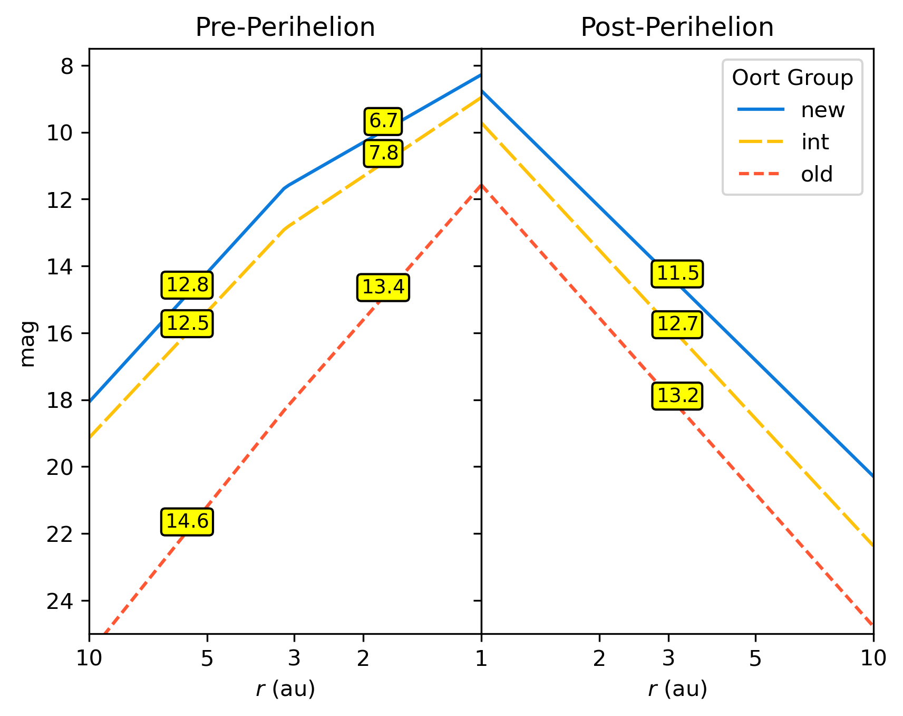

README
======

What the function `total_heliocentric_mag` does
-----------------------------------------------

Calculates total heliocentric magnitude as a function of heliocentric
distance, separated by orbital arc and Oort group. The brightening
parameters, currently hardcoded into dictionary `BRIGHTENING_PARS`, are
median values for a sample of over 200 comets. See Lacerda et al. (2025)
for details.  

Usage
------

```python
total_heliocentric_mag(distance, orbital_arc, oort_group)
```

Examples
---------

```python
>>> print(total_heliocentric_mag(5.0, "inbound", "new"))
output:  14.20233223070413
```

```python
>>> print(total_heliocentric_mag([1.0, 3.0, 10.0], "inbound", "new"))
output:  [ 8.28       11.49031036 18.06966458]
```

```python
>>> print(total_heliocentric_mag([2.3, 3.7], "outbound", "old"))
output:  [16.34842471 19.07594477]
```

Docstring
----------

Calculate total heliocentric magnitude as function of heliocentric distance.

Separates calculation by orbital arc and Oort group using median brightening
parameters from a sample of 200+ comets.

Parameters
----------

`distance` : float or array_like
    Heliocentric distance in au  
`orbital_arc` : {`inbound`, `outbound`}, optional
    Orbital phase (inbound/outbound), default: `inbound`  
`oort_group` : {`new`, `int`, `old`}, optional
    Oort dynamical group, default: `new`

Returns
-------

`median_total_mag` : float or array_like
    Median total heliocentric magnitude. Convert to apparent magnitude by
    adding `5 * np.log10(observer distance)`.

Notes
-----

Uses hardcoded values from dictionary `BRIGHTENING_PARS` structured as:

- Top level: Oort groups (`new`, `int`, `old`)
- Second level: orbital arcs (`inbound`, `outbound`)
- Third level: brightening parameters:
  - `k_near`: Brightening slope inside transition (3.16 au)
  - `k_far`: Brightening slope beyond transition
  - `k1`: Post-perihelion fading slope (outbound only)
  - `m1`: Magnitude at 1 au (phase-dependent)

Transition distance stored in `TRANSITION_R` (3.16 au).

References
----------

If you use this function, please cite:  
Lacerda et al. 2025, A&A, 697, A210 (DOI: 10.1051/0004-6361/202453565)

Todo
----

Implement user-specified parameters and transition distance.

Dependencies
------------

numpy  
typing if python_version < '3.5'

Author
------

Pedro Lacerda (2025-06-16)

What the function `plot_brightening_curves` does
-----------------------------------------------

Plots the brightening curves corresponding to `BRIGHTENING_PARS` to produce this plot:


